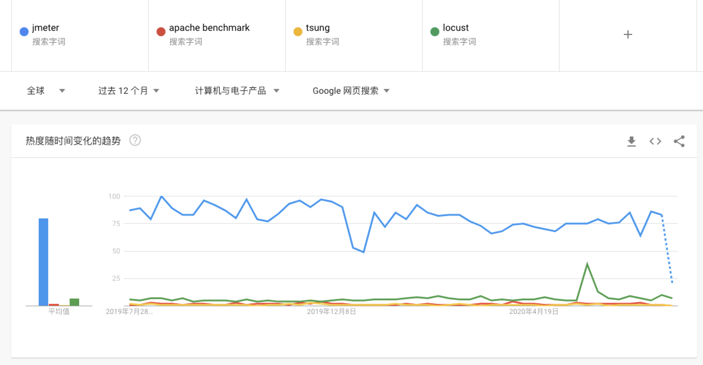
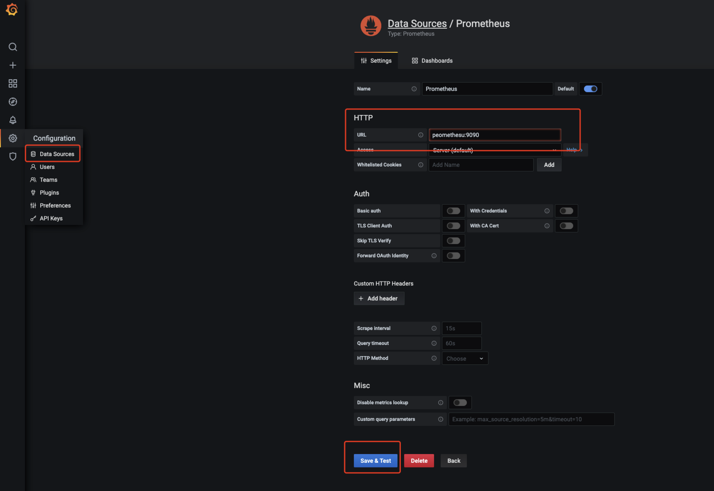
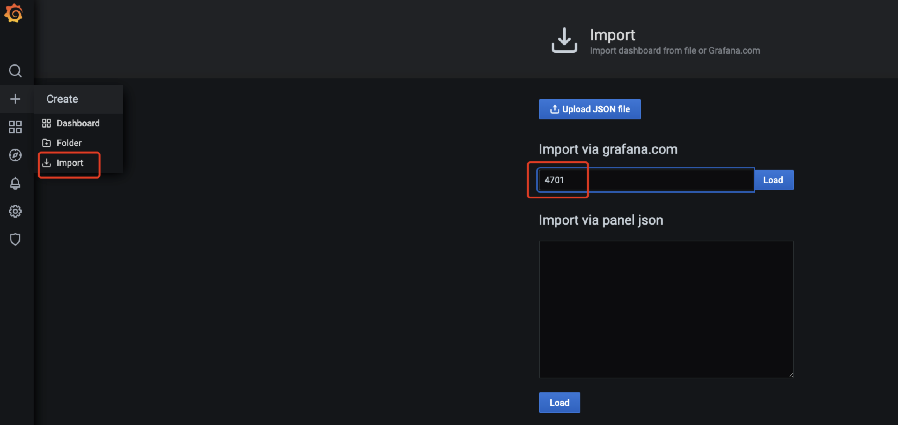

# performance-test
A demo of performance test.

## Why&How Performance Test

* To describe your system;
* To improve your system;
* In a certian function index, build a test model, make a test plan, generate a monitor policy, run test scenario, analysis performance bottleneck and improve your system.

## Tools

* [Jmeter](https://jmeter.apache.org/);
* [Apache Benchmark](http://httpd.apache.org/);
* [Tsung](http://tsung.erlang-projects.org/);
* [Locust](https://locust.io/).

**Trending**:



## Demo

* Mysql: Data from [grouplens Movielens](https://grouplens.org/datasets/movielens/25m/);
* Springboot: A demo provides movies' title search, also provides [actuator](https://docs.spring.io/spring-boot/docs/current/reference/html/production-ready-features.html);
* [Docker](https://www.docker.com/) + [Docker-compose](https://docs.docker.com/compose/)
* [Prometheus](https://prometheus.io/) + [Grafana](https://grafana.com/)

### Actuator

`pom.xml`:

```xml
<dependency>
   <groupId>org.springframework.boot</groupId>
   <artifactId>spring-boot-starter-actuator</artifactId>
</dependency>
```

`application.properties`

```properties
# actuator
management.endpoint.health.show-details=always
management.endpoint.metrics.enabled=true
management.endpoints.web.exposure.include=*
```

### Prometheus

`pom.xml`

```xml
<dependency>
    <groupId>io.micrometer</groupId>
    <artifactId>micrometer-registry-prometheus</artifactId>
</dependency>
```

`prometheus.yaml`

```yaml
# my global config
global:
  scrape_interval:     5s # Set the scrape interval to every 5 seconds. Default is every 1 minute.
  evaluation_interval: 5s # Evaluate rules every 5 seconds. The default is every 1 minute.
  # scrape_timeout is set to the global default (10s).

# Load rules once and periodically evaluate them according to the global 'evaluation_interval'.
rule_files:
  # - "first_rules.yml"
  # - "second_rules.yml"

# A scrape configuration containing exactly one endpoint to scrape:
# Here it's Prometheus itself.
scrape_configs:
  # The job name is added as a label `job=<job_name>` to any timeseries scraped from this config.
  - job_name: 'prometheus'
    # metrics_path defaults to '/metrics'
    # scheme defaults to 'http'.
    static_configs:
    - targets: ['127.0.0.1:9090']

  - job_name: 'spring-actuator'
    metrics_path: '/actuator/prometheus'
    scrape_interval: 5s
    static_configs:
    - targets: ['backend:8080']
```

### Grafana

Default user: admin, default password: admin

Choose data source:

> ⚠️ A typo in url, `promethesu` --> `prometheus`





## How to Play the Demo

The application has two versions, one in the `old` branch, one wth cache is in the `master` branch.

### Docker

Package your project, for example:

```
./mvnw clean package -Dmaven.test.skip=true
```

Check your `Dockerfile`:

```dockerfile
FROM openjdk:13-jdk-alpine
RUN addgroup -S spring && adduser -S spring -G spring
USER spring:spring
ARG JAR_FILE=target/*.jar
COPY ${JAR_FILE} app.jar
ENTRYPOINT ["java","-jar","/app.jar"]
```

Build the image, for example:

```
docker build . -t sjtuse-128/demo:v2
```

If success, you will see:

```
> docker image ls | grep demo
sjtuse-128/demo		v2		ea7cb67e0d33		19 minutes ago		380MB
```

### Docker-compose

Check your `docker-compose.yaml`:

> If you are in the `old` branch, the version of `suture-128/demo` is `v1`.

```yaml
version: '3.2'

services:
  database:
    image: mysql:5.7
    volumes:
      - type: bind
        source: ./data/movies.csv
        target: /var/lib/mysql-files/movies.csv
        read_only: true
    ports:
      - "3306:3306"
    environment:
      - MYSQL_ROOT_PASSWORD=123456
      - MYSQL_DATABASE=demo
    networks:
      - demo

  backend:
    image: sjtuse-128/demo:v2
    ports:
      - "8080:8080"
    environment:
      - JVM_OPTS="-Xms128m -Xmx128m"
    networks:
      - demo

  prometheus:
    image: prom/prometheus
    volumes:
      - type: bind
        source: ./prometheus.yml
        target: /etc/prometheus/prometheus.yml
        read_only: true
    ports:
      - "9090:9090"
    networks:
      - demo

  grafana:
    image: grafana/grafana
    ports:
        - "3000:3000"
    networks:
        - demo

networks:
  demo:
    driver: bridge
```

Start it by `docker-compose up -d`.

You may see the backend server `exited`, this happens because of the database connection failure. Just restart it.

```
docker restart ${YOUR_BACKEND_CONTAINER_ID}
```

> `docker ps -a` will list all containers whatever the status are.

If you want to load the data, go into the database container:

```
docker exec -it performance-test_database_1 bash
```

Login the database by `mysql -u root -p` and then load the data:

```
load data infile '/var/lib/mysql-files/movies.csv'
into table movie
fields terminated by ',' optionally enclosed by '"' escaped by '"'
lines terminated by '\r\n';
```

The whole demo is not out of the box because I didn't package it well. Please bear with me.